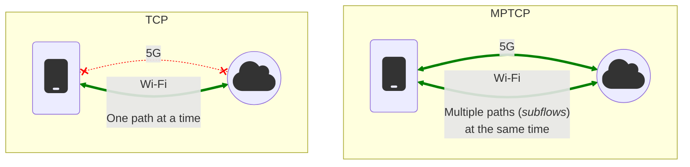

Multipath TCP or [MPTCP](https://en.wikipedia.org/wiki/Multipath_TCP) is an
extension to the standard
[TCP](https://en.wikipedia.org/wiki/Transmission_Control_Protocol) and is
described in [RFC 8684](https://www.rfc-editor.org/rfc/rfc8684.html). It allows
a device to make use of multiple interfaces at once to send and receive TCP
packets over a single MPTCP connection. MPTCP can aggregate the bandwidth of
multiple interfaces or prefer the one with lowest latency, it also allows a
fail-over if one path is down, and the traffic is seamlessly reinjected on other
paths.



Technically, when a new socket is created with the `IPPROTO_MPTCP` protocol
(Linux-specific), a *subflow* (or *path*) is created. This *subflow* consists of
a regular TCP connection that is used to transmit data through one interface.
Additional *subflows* can be negotiated later between the hosts. For the remote
host to be able to detect the use of MPTCP, a new field is added to the TCP
*option* field of the underlying TCP *subflow*. This field contains, amongst
other things, a `MP_CAPABLE` option that tells the other host to use MPTCP if it
is supported. If the remote host or any
[middlebox](https://en.wikipedia.org/wiki/Middlebox) in between does not support
it, the returned `SYN+ACK` packet will not contain MPTCP options in the TCP
*option* field. In that case, the connection will be "downgraded" to plain TCP,
and it will continue with a single path.

This behavior is made possible by two internal components:

* **Path Manager**: Manages *subflows* from creation to deletion, and also
  address announcements. Typically, it is the client side that initiates
  subflows, and the server side that announces additional addresses via the
  `ADD_ADDR` and `REMOVE_ADDR` options.

  ```mermaid
  graph LR;
      C_1(<div style="display: inline-block; min-width: 35px"><font size="7">fa:fa-mobile</font></div>)
      S_1((<div style="display: inline-block; min-width: 60px"><font size="7">fa:fa-cloud</font></div>))

      C_1 -. "Potential subflow" -.- S_1
      C_1 <== "Initial subflow" ==> S_1
      C_1 ~~~|"Subflows creation"| C_1
      S_1 ~~~|"Addresses announcement"| S_1

      linkStyle 0 stroke:orange;
      linkStyle 1 stroke:green;
  ```

{: .note}
As of Linux v5.19, there are two path managers, controlled by the `net.mptcp.pm_type`
sysctl knob: the in-kernel one (type `0`) where the same rules are applied for
all the connections (see: `ip mptcp`) ; and the userspace one (type `1`),
controlled by a userspace daemon (i.e. [`mptcpd`](https://mptcpd.mptcp.dev/))
where different rules can be applied for each connection.

* **Packet Scheduler**: In charge of selecting which available *subflow(s)* to
  use to send the next data packet. It can decide to maximize the use of the
  available bandwidth, only to pick the path with the lower latency, or any
  other policy depending on the configuration.

  ```mermaid
  graph LR;
      A_2(<div style="display: inline-block; min-width: 40px"><font size="7">fa:fa-user</font></div>)

      PS{Packet<br />Scheduler}

      I_21(subflow 1)
      I_22(subflow 2)

      A_2 == "<div style='display: inline-block; min-width: 50px'>fa:fa-box fa:fa-box fa:fa-box</div>" ==> PS
      PS -- "<div style='display: inline-block; min-width: 32px'>fa:fa-box fa:fa-box</div>" --> I_21
      PS -- "<div style='display: inline-block; min-width: 14px'>fa:fa-box</div>" --> I_22
      PS ~~~|"Packets distribution between subflows"| PS
  ```

{: .note}
As of Linux v6.8, there is only one packet scheduler, controlled by sysctl knobs
in `net.mptcp`.

## Features

As of Linux v6.10, major features of MPTCP include:

* Support of the [`IPPROTO_MPTCP`](implementation.html) protocol in `socket()`
  system calls.
* Fallback from MPTCP to TCP if the peer or a middlebox do not support MPTCP.
* Path management using either an in-kernel or userspace path manager.
* Socket options that are commonly used with TCP sockets.
* Debug features including MIB counters, diag support (used by the `ss`
  command), and tracepoints.

See the
[ChangeLog](https://github.com/multipath-tcp/mptcp_net-next/wiki/#changelog)
for more details.

## Communication

* Mailing List: mptcp@lists.linux.dev (and [archives](https://lore.kernel.org/mptcp))
* IRC: [#mptcp](https://web.libera.chat/?nick=mptcp-dev-guest?#mptcp) on libera.chat
* Online [Meetings](https://github.com/multipath-tcp/mptcp_net-next/wiki/Meetings)

## Projects

* Maintained by MPTCP community members
  * [Kernel development on GitHub](https://github.com/multipath-tcp/mptcp_net-next/)
  * [Multipath TCP Daemon](https://github.com/multipath-tcp/mptcpd)
    * The [`mptcpd`](https://www.mankier.com/8/mptcpd) daemon can do full
      userspace path management or control the in-kernel path manager.
    * Includes the [`mptcpize`](https://www.mankier.com/8/mptcpize) utility to
      allow legacy TCP binaries to use MPTCP.
  * [Packetdrill with MPTCP support](https://github.com/multipath-tcp/packetdrill)
* Projects with MPTCP-related enhancements
  * [iproute2](https://wiki.linuxfoundation.org/networking/iproute2) (for the
    [`ip mptcp`](https://www.mankier.com/8/ip-mptcp) command)
  * [Network Manager](https://networkmanager.dev): MPTCP features are included
    starting with v1.40.
  * [Multipath TCP applications](https://github.com/mptcp-apps/): A project to
    coordinate MPTCP updates for popular TCP applications.

## Kernel Development

* [Git Repository](https://github.com/multipath-tcp/mptcp_net-next.git)
  ([branch descriptions](https://github.com/multipath-tcp/mptcp_net-next/wiki/Git-Branches))
* [Patchwork](https://patchwork.kernel.org/project/mptcp/)
* [Continuous Integration](https://github.com/multipath-tcp/mptcp_net-next/wiki/CI)
* [Testing](https://github.com/multipath-tcp/mptcp_net-next/wiki/Testing)
* [Issue tracker](https://github.com/multipath-tcp/mptcp_net-next/issues)
