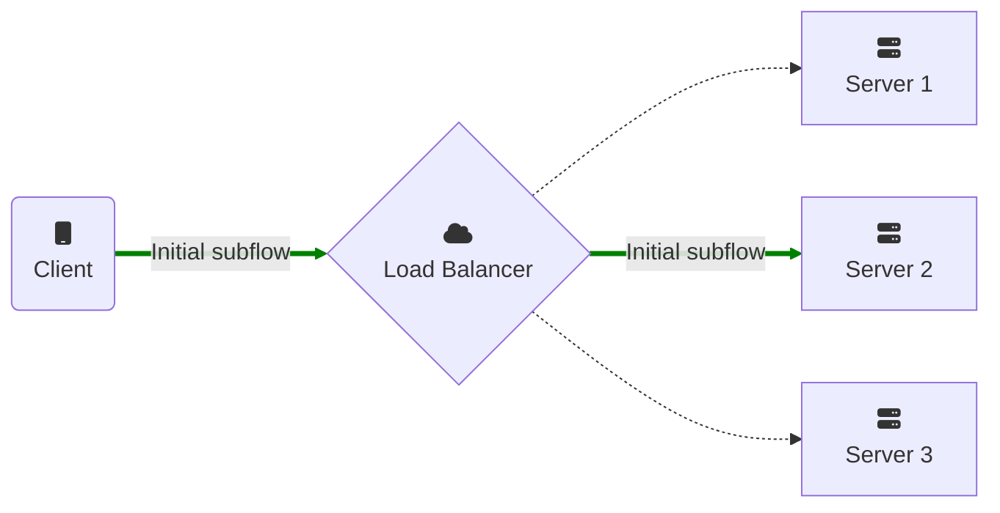
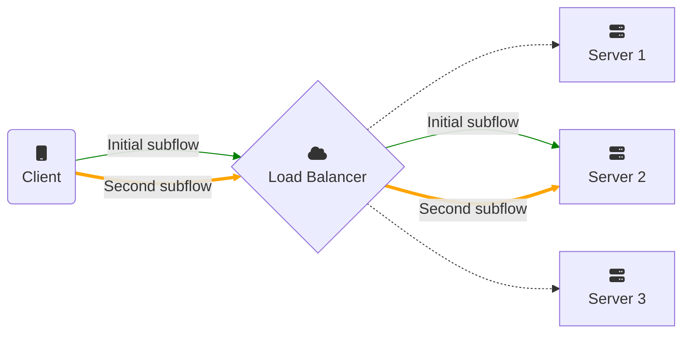

## Overview

Supporting MPTCP on the server side is easy when services are directly exposed
to the Internet: it's generally just a matter of enabling MPTCP support in the
[applications](apps.html), or
[forcing them to use it](setup.html#force-applications-to-use-mptcp), that's it.

When services are exposed behind a L4 load balancer, it is important to make
sure the additional subflows will reach the same end-server, and not another one
sharing the same public IP (ECMP or Anycast servers).

### First path: no change

Creating the first subflow (or *path*) is easy: on the wire, this MPTCP subflow
is seen as a TCP connection with extra TCP options. It means nothing needs to be
modified.



### Extra paths: static redirection

The extra subflows need to reach the same end-server. Such subflows will have
different source IP addresses and/or ports. A stateless L4 load-balancer needs
extra information to pick the same end-server as the one which accepted the
initial subflow.



If the extra subflows try to connect to the same destination IP address and
port, a stateless L4 load-balancer will not be able to pick the right server.

### Solution

The [MPTCP protocol](https://www.rfc-editor.org/rfc/rfc8684.html) suggests
handling this case like this:
- A server behind a L4 load-balancer should mention in its replies to MPTCP
  connection requests (`MP_CAPABLE`) that *it will not accept additional MPTCP
  subflows to the same IP address and port* (via the `C-flag`).
- Additionally, such server should announce an extra address (`ADD_ADDR`) with a
  v4/v6 IP address and/or port that are specific to this server.
- A L4 load-balancer should route traffic to this specific IP and/or port to the
  right server.

In other words, on Linux, it means that each server should:
- set the [`net.mptcp.allow_join_initial_addr_port`](https://docs.kernel.org/networking/mptcp-sysctl.html)
  sysctl knob to `0`
- add a `signal` MPTCP endpoint with a dedicated IP address and/or port:
  ```
  ip mptcp endpoint add <public IP address> dev <interface> [ port NR  ] signal
  ```

{: .note}
A stateful load-balancer could compute the MPTCP receiver's token from its key
exchanged in the connection request (`MP_CAPABLE`), and route additional
subflows to the same server by identifying the receiver's token from the join
request (`MP_JOIN`). Be careful that there is a risk of token collision, and
such load-balancer should handle the case where multiple end-servers are using
the same token for active MPTCP connections.

## CDNs

Supporting MPTCP would be beneficial for the users, to be able to easily benefit
from MPTCP: seamless handovers, best network selection, and network aggregation.

Here is a checklist for CDN owners implementing MPTCP support:
- [ ] Frontend:
  - [ ] Application: [enable MPTCP support](apps.html),
        [modify it to create an MPTCP socket](implementation.html), or
        [force it to use MPTCP](setup.html#force-applications-to-use-mptcp).
  - [ ] System: set [`sysctl net.mptcp.allow_join_initial_addr_port=0`](https://docs.kernel.org/networking/mptcp-sysctl.html)
  - [ ] System: Add a `signal` MPTCP endpoint with a dedicated IP v4/v6 and/or
        port per end-server:
  ```
  ip mptcp endpoint add <public IP address> dev <interface> [ port NR ] signal
  ```
- [ ] Stateless L4 Load-Balancer:
  - [ ] Add rules to route TCP flows to a specific IP and/or port to the
        corresponding server.
  - [ ] Optionally block all non MPTCP connections, and rate limit connections
        requests.
