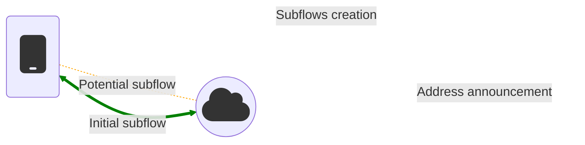

The Path Manager is in charge of *subflows*, from creation to deletion, and also
address announcements. Typically, it is the client side that initiates subflows,
and the server side that announces additional addresses via the `ADD_ADDR` and
`REMOVE_ADDR` options.



As of Linux v5.19, there are two path managers controlled by the netns-aware
`net.mptcp.pm_type` sysctl knob: the [in-kernel](#in-kernel-path-manager) one
(type `0`), and the [userspace](#userspace-path-manager) one (type `1`).

## In-kernel Path-Manager

With the (default) in-kernel Path-Manager, the same rules are applied to all
connections. Address endpoints and limits can be set to control its behavior.

Its configuration can be automated with tools like
[NetworkManager](https://networkmanager.dev) and
[`mptcpd`](https://mptcpd.mptcp.dev), or done manually using the `ip mptcp`
command.

### Automatic configuration

{: .info }
NetworkManager 1.40 or newer automatically configures MPTCP endpoints with
the `subflow` flag ("client" mode) by default
([source](https://networkmanager.dev/blog/networkmanager-1-40/#mptcp-support)),
similar to what `mptcpd` does by default. **The manual configuration might then
not be needed**.

To change this behavior, with NetworkManager, look for the
`connection.mptcp-flags` option in the
[settings](https://networkmanager.dev/docs/api/latest/nm-settings-nmcli.html#nm-settings-nmcli.property.connection.mptcp-flags),
while for `mptcpd`, look at the `/etc/mptcpd/mptcpd.conf` config file, or
disable the service if it is not needed. Make sure not to have both
NetworkManager and `mptcpd` conflicting to configure the MPTCP endpoints.

### Manual configuration

This can be done using the `ip mptcp` command. Please check the manual for more
details: [`man ip-mptcp`](https://man7.org/linux/man-pages/man8/ip-mptcp.8.html).
Note that Busybox's `ip` command doesn't support MPTCP yet. You need the "full"
version from the [IPRoute2](https://wiki.linuxfoundation.org/networking/iproute2)
project.

#### Endpoints

MPTCP endpoints can be manually configured with this command:

```sh
ip mptcp endpoint add <IP address> dev <interface> [ signal | subflow ] [ backup ] [ fullmesh ]
```

{: .warning}
It is important to specify the network interface linked to the address by adding
`dev <interface>`. If not, the routing will probably not be done properly, and
will require manual configuration, see below:
[Manual Routing Configuration](#manual-routing-configuration).

One of the following flags needs to be set:
- `signal`: The endpoint will be announced to each peer via an MPTCP `ADD_ADDR`
  sub-option. Typically, a server would be responsible for this.
- `subflow`: The endpoint will be used to create an additional subflow using
  the given source IP address to the other peer's IP address from the initial
  subflow. A client would typically do this.

Optionally, the following flags can be added next to one of the previous ones:
- `backup`: Subflows created from this endpoint instruct the peers to only send
  data on it when all non-backup subflows are unavailable.
- `fullmesh`: The MPTCP path manager will try to create an additional subflow
  for each known peer address, using this endpoint as the source IP address. It
  requires the `subflow` flag, and it is not compatible with the `signal` one.

It is also possible to specify a `port` number with the `signal` endpoints: this
will advertise an IP address and a port number, and accept new subflows on this
additional address and port. This was also called the `ndiffports` technique.
When used with the [`allow_join_initial_addr_port`](https://docs.kernel.org/networking/mptcp-sysctl.html)
sysctl set to 0, this can be useful for servers deployed behind a load balancer.

The IP address is an IPv4 or IPv6 address. The endpoints are netns-aware. The
current endpoints can be seen using:

```sh
ip mptcp endpoint
```

#### Example

- Servers can announce extra IP addresses:
```sh
ip mptcp endpoint add 10.2.2.2 dev eth0 signal
```

- Clients can create additional subflows from a cellular interface, and flag
  this subflow as "backup", to be used to carry data only if the main path is
  unavailable:
```sh
ip mptcp endpoint add 100.64.1.134 dev usb0 subflow backup
```

#### Limits

It is also important to make sure the limits are high enough:

```sh
ip mptcp limits set [ subflows NR ] [ add_addr_accepted NR ]
```

- `subflows` is the limit of additional created and accepted subflows (paths),
  for both the client and server sides (default is 2).
- `add_addr_accepted` is the limit of accepted `ADD_ADDR` -- IP address
  notification from the other peer -- that will result in the creation of
  subflows, typically only for the client side (default is 0).

The limits are per MPTCP connection, and netns-aware. The current limits can be
seen using:

```sh
ip mptcp limits
```

{: .note}
It is possible to reach the limits with fewer established subflows than
expected, e.g. when new subflow requests cannot reach the other peer. In case of
problem, please increase the limits, use `ss -Mai` to check the counters, and
modify the routing or firewall rules to avoid using certain paths between
specific IP addresses. For example, in a lab setup with dedicated links, use
specific routes rather than letting the kernel select the default route.

### Behavior

By default, the Path-Manager tries not to create too many subflows using the
encoded [endpoints](#endpoints), and following the imposed [limits](#limits).

{: .note}
Technically, the Path-Manager can only attach new subflows, and announce
addresses on MPTCP connections that are considered as *fully established*:
typically when the first data has been sent.

#### Announcing new addresses

All endpoints flagged as [`signal`](#endpoints) will be announced via an
`ADD_ADDR` notification. That is typically what a server would do, to let
clients connect to other available addresses if needed.

This will be done, one at a time: once the MPTCP connection is *fully
established*, and each time a new subflow is established. This behaviour might
change in the future, if someone implements the ticket
[#334](https://github.com/multipath-tcp/mptcp_net-next/issues/334).

By default, [automated tools](#automatic-configuration) will add
[`subflow`](#endpoints) endpoints, not [`signal`](#endpoints) ones. This
behavior can be modified, please check their manual.

#### Creating new subflows

There are two cases that involve the creation of new subflows, if allowed by
the `subflows` [limit](#limits):

- Endpoints flagged as [`subflow`](#endpoints) will be used to create new
  subflows, one at a time, to the address of the server used in the initial
  subflow. Each endpoint should only be used once, except if the
  endpoint has the [`fullmesh`](#endpoints) flag.

- Upon the reception of an [`ADD_ADDR`](#announcing-new-addresses), and if the
  `add_addr_accepted` [limits](#limits) has not been reached yet, a new subflow
  will be created using the local address the routing configuration will pick,
  except if there are endpoints with the [`fullmesh`](#endpoints) flag. In this
  case, each endpoints with the [`fullmesh`](#endpoints) flag will be used to
  create a new subflow to the announced address.

Note that when subflows are closed before the end of a connection -- e.g. due to
an error on the network, or if the other peer closed subflows -- the
Path-Manager will not try to re-establish them. This behaviour might change in
the future, if someone implements the ticket
[#440](https://github.com/multipath-tcp/mptcp_net-next/issues/440).

#### Accepting new subflows

If the request is valid, the peer will accept the creation of new subflows, as
long as the `subflows` [limit](#limits) has not been reached yet.


## Userspace Path-Manager

With the userspace MPTCP path-manager -- `sysctl -w net.mptcp.pm_type=1` --
different rules can be applied for each connection. The path-manager will then
need to be controlled by a userspace daemon, i.e.
[`mptcpd`](https://mptcpd.mptcp.dev). In this case, the configuration has to be
done on the userspace daemon side.

{: .note}
`mptcpd` can help to create custom userspace Path-Managers: please check this
[Plugins](https://github.com/multipath-tcp/mptcpd/wiki/Plugins) page for more
details about that.

## Notes

Be aware that a strict `rp_filter` breaks MPTCP use-cases. So if MPTCP handling
on an interface is enabled, it is recommended to relax a strict setting (`1`) to
loose reverse path filtering (`2`):

```bash
sysctl -w net.ipv4.conf.<INTERFACE>.rp_filter=2
```

That's something NetworkManager 1.40 or newer does automatically.
